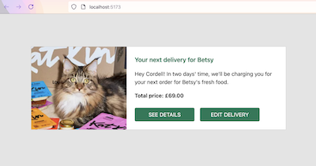
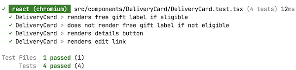

## Getting started

1. Download the [server application](https://github.com/luke-symes/cat-food-test-server) and follow the setup instructions.

1. If you use [nvm](https://github.com/nvm-sh/nvm) to manage node versions, please run `nvm use` in the root of this project. Otherwise, the project uses `v22.13.0` of [Node.js](https://nodejs.org/en/about/previous-releases).

1. Install dependencies with `npm install`

1. With the server running from step 1, run the following in your terminal to start the client

```sh
npm run dev
```

The Vite server will start on http://localhost:5173 by default. Open in a web browser to view the page.

You should see the following screen:



## Technologies used

- [Vite](https://vite.dev/) for quickly bootstrapping and bundling a client-side React app with TypeScript
- [Storybook](https://storybook.js.org/) to develop & test UI components in isolation
- [Zod](https://zod.dev/) for schema validation of the API data
- [SWR](https://swr.vercel.app/) for data fetching & caching
- ESLint & Prettier for fixing & formatting code

## Storybook

To run the Storybook server:

```sh
  npm run storybook
```

## Tests

Unit tests for the `DeliveryCard` component can be run with `npm run test`

The following output should appear in your terminal:



Storybook's test runner has also been configured to test for accessibility violations. To run:

1. Start the Storybook server with `npm run storybook`
1. Run the tests with `npm run test-storybook`

## Suggested improvements

With more time, there are several improvements I would make to this project to ensure it is ready for production, including:

- Intercept network calls and mock responses with [Mock Service Worker](https://mswjs.io/) to allow functionality without depending on the server.

- Handle loading state in the UI with a skeleton or placeholder

- Share the API schema from a single location so that a contract may be enforced between the client and server. Currently the client defines its own Zod schema and is unaware of any changes made on the backend.

- Errors are logged to the console but would be better suited to an observability platform like Sentry

- Automate workflows in CI/CD using GitHub actions for tasks like type checking, linting, formattting and running tests

- Mock the image in a way that it could be sourced from an API such as a content management system. For convenience, it's located in the `public` directory so it can be easily managed by Vite.

- Additional ESLint plugins to enforce import sorting and file name conventions

- Story decorators are duplicated and defined for each story due rather than in a global context to an TypeScript issue; more time is needed to investigate
